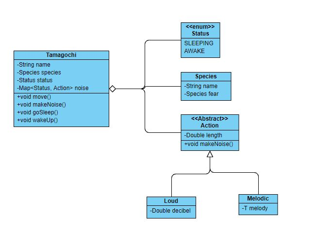

# InvGate
## Exercises
### Algorithm

Para correr el proyecto debe pasar como parámetro la ruta del archivo donde están los datos de entrada (en caso de no poner ruta, sino el nombre del archivo, debería estar en `/InvGate/Exercises/Algorithm` 

e.g. `java -jar algorithm.jar case_1_input.txt`

El programa printeará el resultado esperado.

----------------------------------

### DB

Este ejercicio se resolvió como si fuera MySQL (o al menos pensando en ese formato, funcionaría en *casi* todas las bases de datos relacionales) y supone que **la tabla donde está la información se llama _exercise_**.

----------------------------------

### Design

Este ejercicio tiene en cuenta varias cosas:
  - Cada tipo de sonido va a ser una extensión de un Action o de un tipo de Action (Loud / Melodic)
  - No tiene en cuenta constructores ni getters/setters
  - Al crear un tamagochi, se le asignaran las acciones para cada tipo de estado que se quiera
  - Un tamagochi solo puede tener un estado al mismo tiempo (si está *feliz*, no está *despierto*)
  
Teniendo en cuenta esto, cada vez que se cree un nuevo estado solo hay que crear el *Action* correspondiente y agregárselo al tamagochi.

